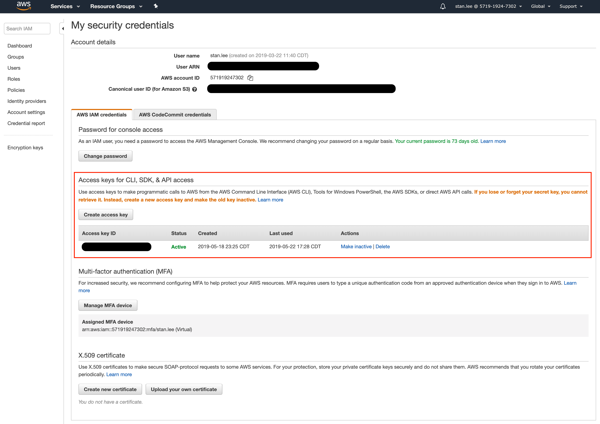

## AWS Setup

AWS setup files are in `~/.aws`. Two files-`config`, `credentials` need to be setup like this:

[config]

```
[default]
region = <region>
output = json

[profile MyProfile]
role_arn = <role_arn>
source_profile = default
```

[credentials]

```
[default]
aws_access_key_id = <access_key_id>
aws_secret_access_key = <secret_access_key>
```

You can find those info from this webpage: (User ARN is `role_arn`)



However, after the initial creation of teh access key, you cannot view secret access key (although you can see Access Key ID). So please store the secret access key in a secure place after creating it.

[Ref.] <br>
https://help.bittitan.com/hc/en-us/articles/115008255268-How-do-I-find-my-AWS-Access-Key-and-Secret-Access-Key-
https://aws.amazon.com/blogs/security/wheres-my-secret-access-key/

## CDK Deployment - Profile Names

For this deployment you MUST have the following profiles. Follow this naming convention otherwise you will not be able to deploy in the AWS environments:

**~/.aws/config:**

```
[default]
region = <region>
output=json

[profile develop]
region = <region>
output=json

[profile sandbox]
region = <region>
output=json
```

**~/.aws/credentials:**

```
[default]
aws_access_key_id = <access_key_id>
aws_secret_access_key = <secret_access_key>
region = <region>

[develop]
aws_access_key_id = <access_key_id>
aws_secret_access_key = <secret_access_key>
region = <region>

[sandbox]
aws_access_key_id = <access_key_id>
aws_secret_access_key = <secret_access_key>
region = <region>
```

## CDK Deployment - Setting Default Profile

**IMPORTANT:** In your operating system, set the environment variable `AWS_PROFILE` to the profile you wish to deploy this to, Ie. if this is going to the development enviroment and the profile with the development decdentials is called `develop` and you use .zsh as your shell:

1. Open ~/.zshrc in a text editor
1. Add `export AWS_PROFILE=develop` to the top
1. Run `source ~/.zshrc`
1. Check the variable is set by running `printenv`
